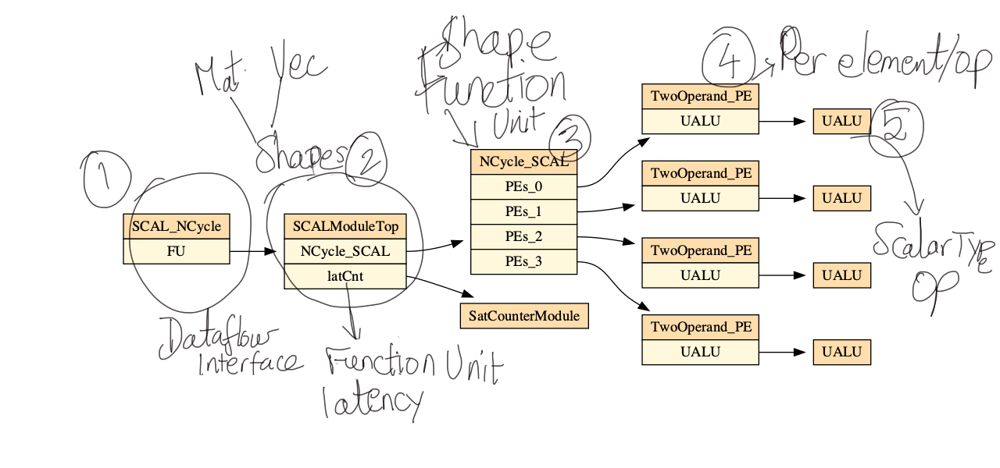

# DNN Branch

This section is a design document for the DNN operators in Dandelion.
The DNN branch provides a set of fundamental tensor operators for implementing DNN algorithms. The operators granularity here is similar to low-level IR in glow.

The idea here is that there is a higher-level DSL compiler that translates the ML algorithm into a program-dependence-graph (loops and all) in which each operator is mapped one-to-one to the operators specified here. Each high-level node in a DNN is translated into one or more operators here.

The low-level set of operators enables a set of hardware independent, but microarchitecture level optimizations that are not feasible with kernel level graph formats of typical DNN frameworks (e.g., TVM). This is an instruction-based representation that operates on tensors that are referenced by address or local scratpads. This gives the ability to perform low-level hardware optimizations with a tensor-based abstraction because memory is not represented directly. An example of such a transformation is the optimization that allows certain operations to transform some buffers in-place, such as element-wise arithmetic.

The low-level set of operators allow the hardware accelerator to create and optimize scatter/gather DMA operations. Hiding the latency of memory operations is important for utilizing the execution units of the hardware effectively, and the instruction-based representation allows the compiler to create a schedule that hides the latency of the memory operations.

---
# Summary of Operators 

| Node   | Inputs                            | Function Unit  | IsSign? | IsCol? | IsHalf? | Primitive     | CORDIC opcodes (Non-Synthesizable) |
|--------|-----------------------------------|----------------|---------|--------|---------|---------------|------------------------------------|
| GEMM   | mat, [][] * [][]                  | SystolicSquare | --      | --     | --      | mac           | ---                                |
| GEMV   | mat, vec                          | GEMV Types     | ---     | Y      | --      | +,- (not ALU) | ---                                |
| SCAL   | mat/vec, scalar                   | NCycle_SCAL    | Y       | ---    | ---     | TwoOperand_PE | Y                                  |
| Dot    | mat, mat OR vec,vec e.g., [] . [] | NCycle_Dot     | Y       | ---    | ---     | TwoOperand_PE | ---                                |
| Reduce | mat or vec (output: scalar)       | NCycle_Reduce  | Y       | ---    | ---     | TwoOperand_PE | ---                                |
|        |                                   |                |         |        |         |               |                                    |
Building CORDIC units can take a long time even for small designs (10+ minutes).

### Future Plans
1. Support for Half width ALUs


# Design Overview

The hardware design of the DNN operators is hierarchical with multiple levels of nested classes. This permits a highly modular and flexible implementation, in which

- we can easily add additional shapes (e.g., 3d or 4d tensors)
- add additional primitive operators incrementally and support non-syntheisable operators (e.g., log)
- support various number formats (fixedpoint, Uint, floating point)

We illustrate the class hierarchy for the GEMM and SCAL (element-wise) operators and describe the purpose of each layer.

## SCAL Operator node



#### Dataflow node

The purpose of this class is to permit the creation of a dataflow operating on shapes. The node internally includes buffering for the shape width for each input and 1 output. 

```scala
new SCAL_NCycle(NumOuts = 1, ID = 0, lanes = 4, "Mul")(new FXmatNxN(2,4)))
```

| Param             |                                                                                            Desc                                                                                             |
| ----------------- | :-----------------------------------------------------------------------------------------------------------------------------------------------------------------------------------------: |
| Numouts           |                                                                          Number of dependent operators in dataflow                                                                          |
| ID                |                                                                       Unique integer identifying operator in dataflow                                                                       |
| lanes,"Mul"       |                                                                                Params passed to NCycle_SCAL                                                                                 |
| new FxmatNxN(2,4) | Shape type the node will process. 2x2 matrix; the shape IOs will be row-major vector. Size 4 elements. Each element is a fixed point with xlen (see config) bits and 4 bits fraction point. |


Figure shows the general operation of the dataflow node. In the first step the node buffers the input required (in the case of SCAL an entire flat vector representing the shape and a scalar). Sets the activate of module top (for one cycle only) and then waits for a valid signal from module to indicate data is available. Finally, the data is sent out to the dependent node, the entire flat vector is transmitted in one cycle completely in parallel. 

#### Known Limitations
- This node does not permit a streaming interface (even if internal modules do)
-  The buffering required can be excessive since the entire shape is buffered.
- The buffers are transmitted between the nodes in one cycle. 

## ModuleTop ##

The purpose of this module is to 

1. isolate the actual type class invocations from the rest of the dataflow node. 

 2. It also deals with pipelined/non-pipelined function units and latency-sensitive fixed-latency function units. The dataflow nodes themselves are unaware of the actual latency of the function unit.
 3. Convert the input bits to the actual type and then apply type-specific implementations [Shape-specific type classes](../src/main/scala/dnn/types)
 
